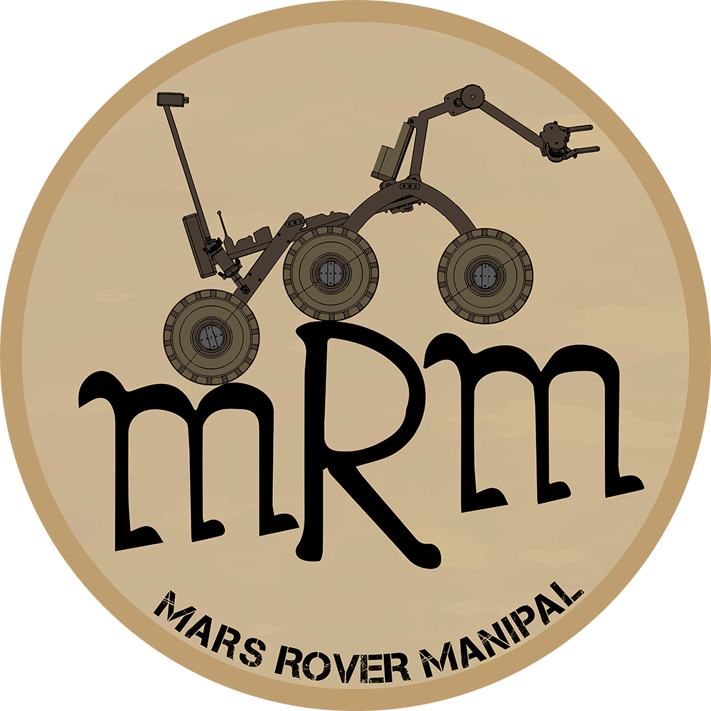
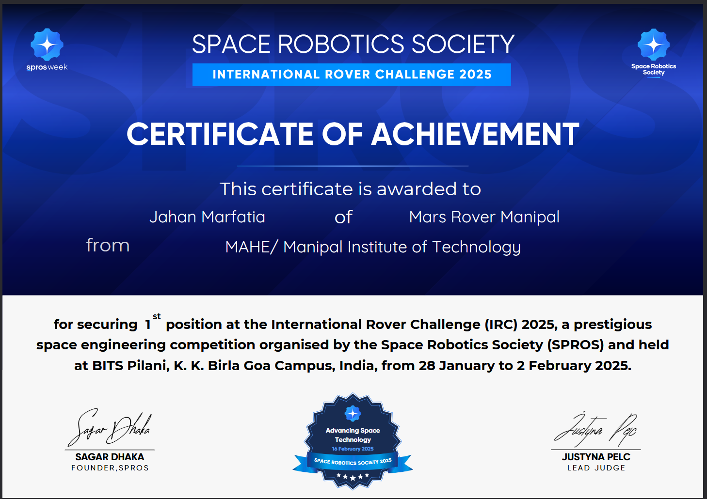
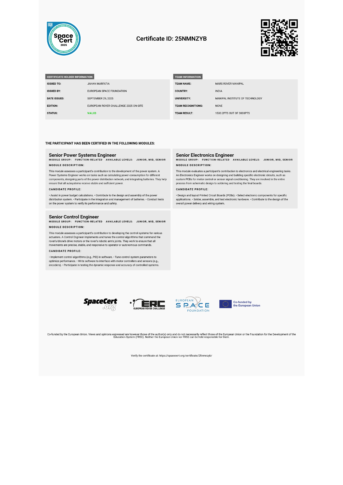

    

# Mars Rover Manipal (MRM) - Electronics and Control Systems

This repository holds my work from the Electronics and Control Systems team at Mars Rover Manipal, MAHE's rover design team. I was on the team in 2025. That year we placed 1st in the International Rover Challenge (IRC) and 10th in the European Rover Challenge (ERC).

## What I worked on

I designed custom PCBs in Altium Designer for motor drivers and sensor interfaces, with most of the effort going into signal integrity and getting the boards ready to manufacture. I also worked on the power distribution and motor control side of the rover's locomotion system, and ran the hardware debugging for both, using oscilloscopes, multimeters, and signal analyzers to track down issues.

On the firmware side, I wrote ESP32 code to interface sensor modules for telemetry and control. I also built a MATLAB script for drone flight automation that talked to a Python object detection library to handle navigation.

Most of this work involved coordinating with the Mechanical, Software, and AI teams, since the electronics had to interface with all of them.

## Repository structure

- [`MCU_Projects/Final System/`](MCU_Projects/Final%20System/) - Embedded C++/Arduino/MicroPython code for the ESP32 and other microcontrollers
- [`PCB_Altium/ERC-boards/`](PCB_Altium/ERC-boards/) - PCB design files: schematics, layouts, and Gerber files for the custom boards
- [`certificates/`](certificates/) - Team certificates and branding assets

## Certificates

International Rover Challenge, 1st place:

European Rover Challenge, 10th place:

